# Servidor Correo Linux **iRedMail**

## Configuración Máquina virtual

### Red
- Nat
- Host-Only

### Nombre del sistema

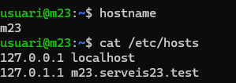

Asignamos como hostname **m23** y en la carpeta de /etc/hosts **m23.serveis23.test**

## Instalación iRedMail

### Wget

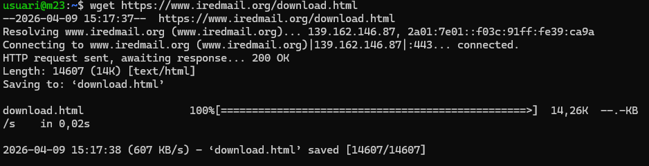

Con la comanda **wget** instalamos la **última versión** del **iRedMail** 

### Tar

Con la comanda **tar** descomprimimos el archivo el cual se descomprimirá en la misma ruta en la que estemos en ese momento

### Bash

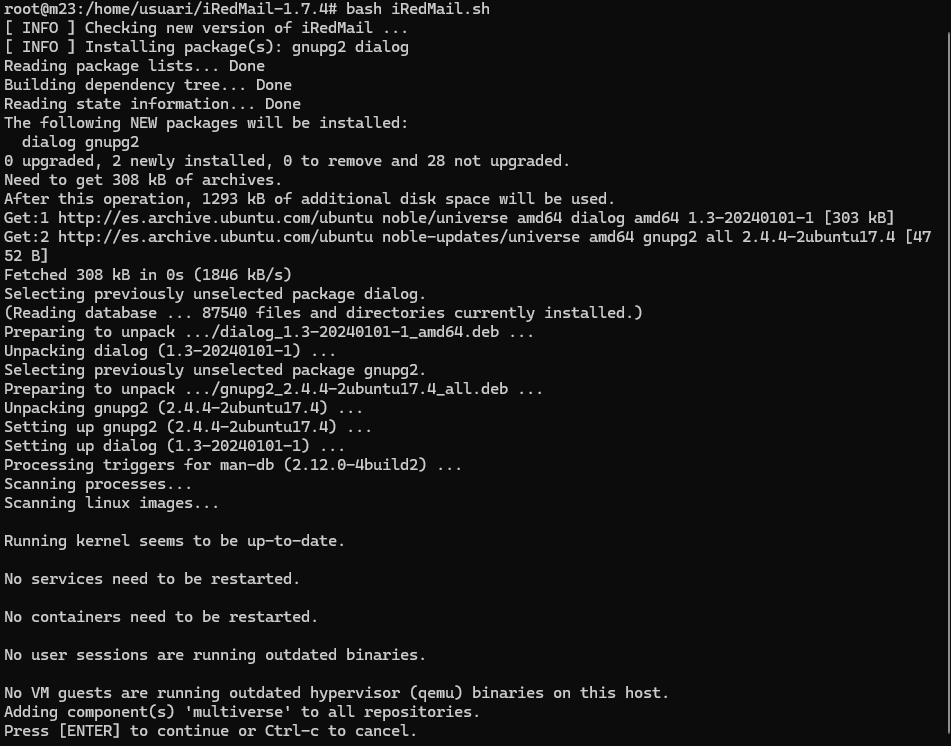

Con la comanda **bash** lo que hacemos es ejecutar el script el cual nos permitirá abrir iRedMail

## Configuración iRedMail

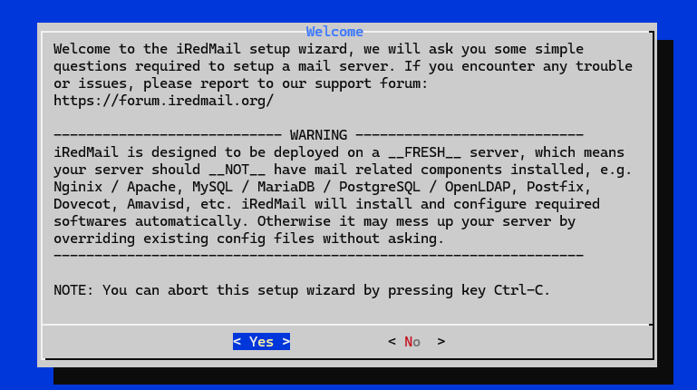
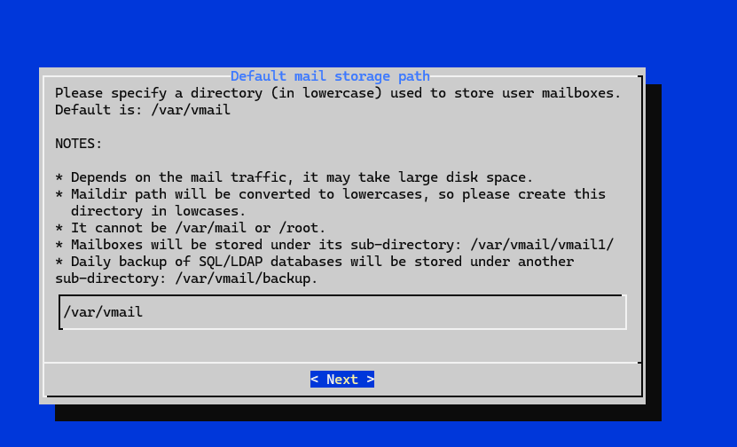
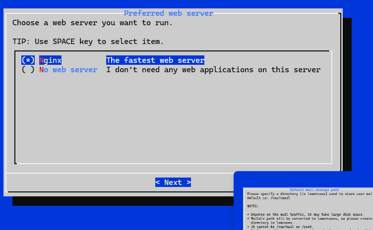

En las capturas que se muestran no hacemos ningún cambio

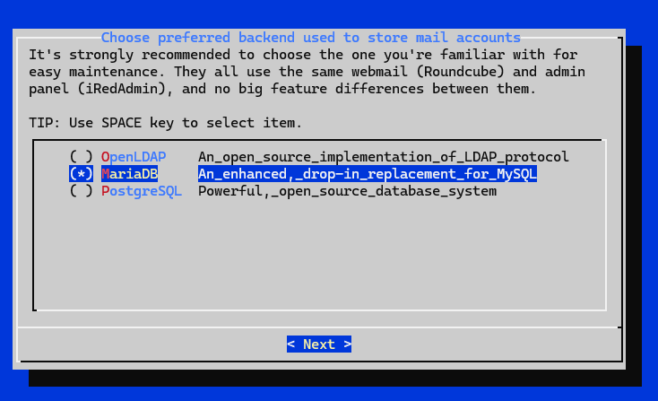

En cambio en esta captura, seleccionamos la segunda opción **MariaDB**

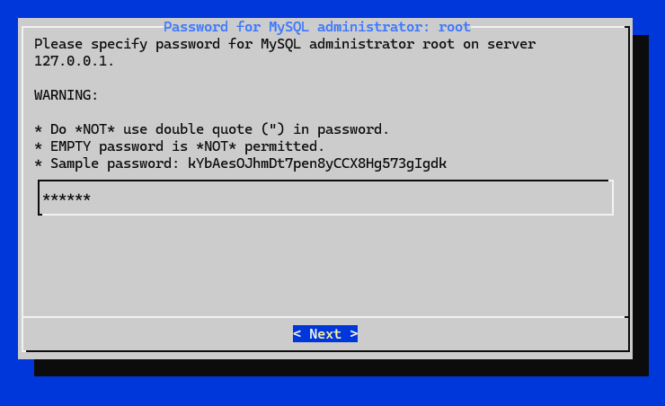

Asignamos una **contraseña**

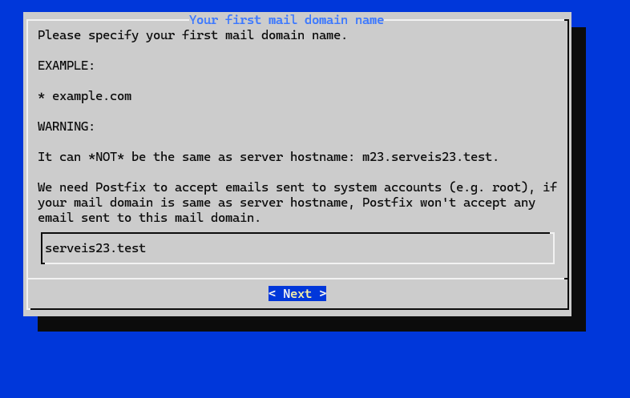

Asignamos el correo del **dominio** que **NO** no puede ser igual al que tenemos como hostname en el Ubuntu Server

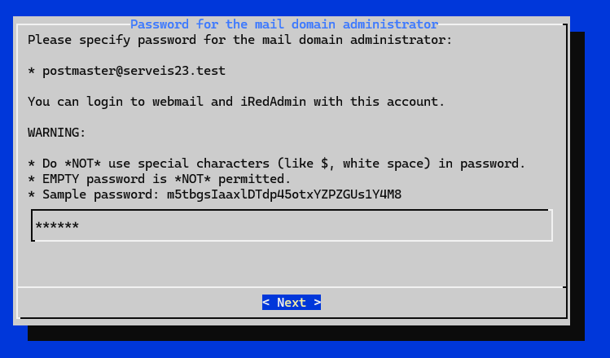

Asignamos una **contraseña**

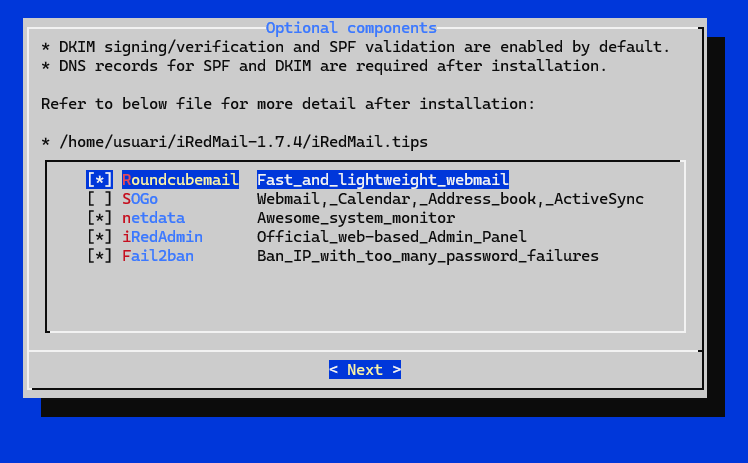

Seleccionamos las **4** opciones marcadas

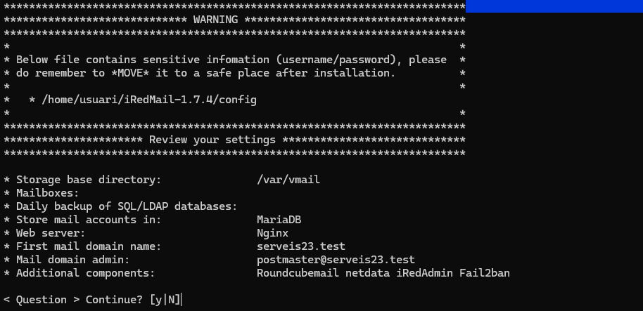

Esta captura nos muestra un **resumen** de la configuración que hemos hecho y nos da la opción de cambiar algo en el caso que haga falta

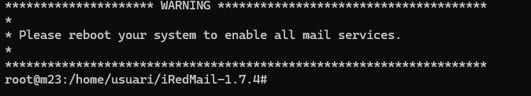

Nos pide que **reiniciemos** el sistema

## Login iRedMail

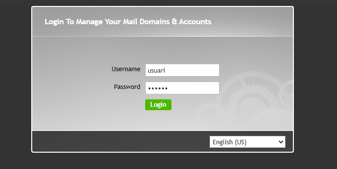

La URL para llegar a esta página es **https://192.168.56.107/iredadmin/** 

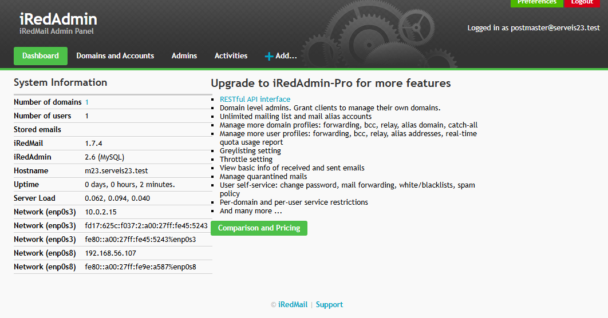

Este es el **panel** que se nos muestra al entrar

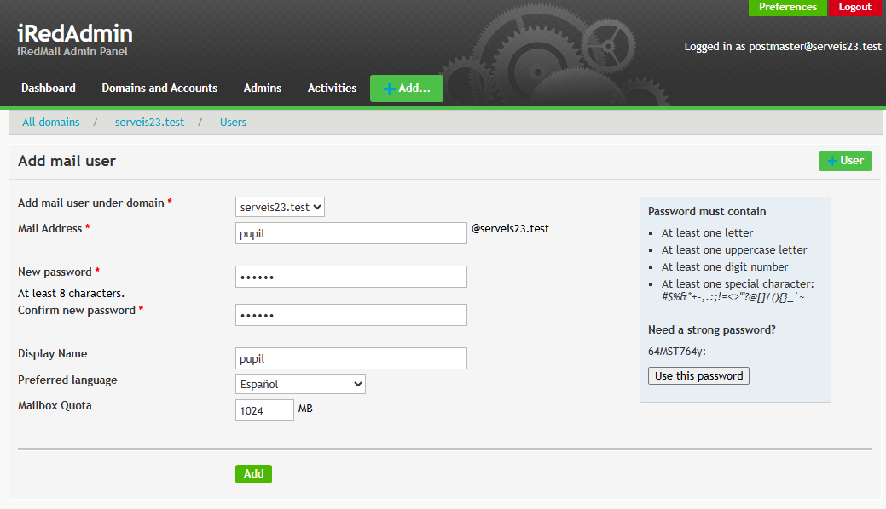

Para **crear** el usuario tendremos que ir a:
- +Add
  - User
Aquí se rellena con la información con la cual queramos poner

Como podemos ver se ha creado **exitosamente**

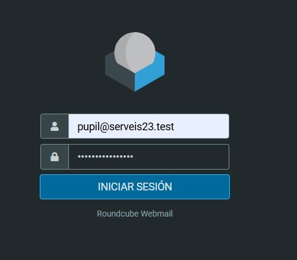

La URL oara llegar a esta página es **https://192.168.56.107/mail/** y logueamos con el usuario que hemos creado anteriormente

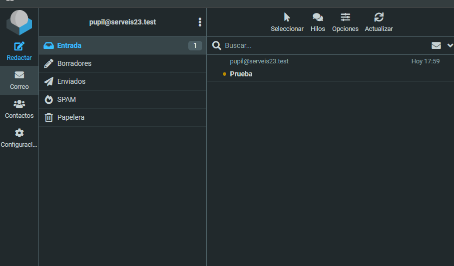

Hemos hecho una **prueba** de enviarnos a nosotros mismos un correo y podemos ver que funciona **exitosamente**