# AA1ServidorFitcherosWS

## Descripcion de la actividad

### La acticidad se divida en fitas que simulan el prceso de consultoria y implementación real

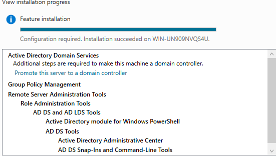

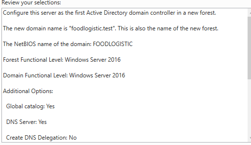

Aqui desplegamos el dominio y como podemos ver se llamará **FOODLOGISTIC**

## 1. Preparación i Seguridad de Grupos (AD)

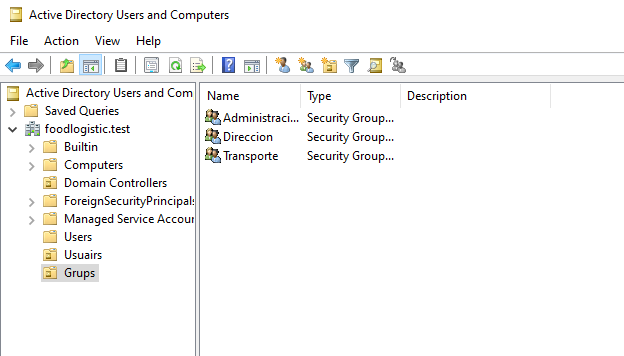

Aquí podemos observar los grupos que hemos creado: 

- **Administración**: Gestión de facturas i albaranes.
- **Transporte**: Chofers i jefes de flota.
- **Dirección**: Gerencia.

## 2. Implementación de Recursos Compartidos 


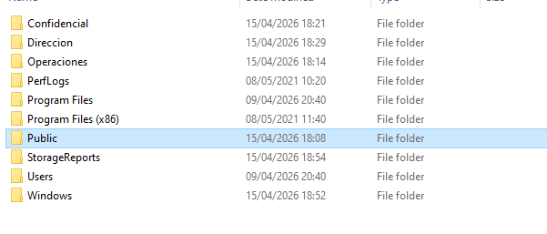

Creamos la carpeta **public**

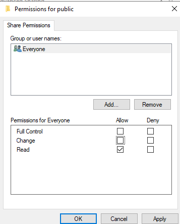
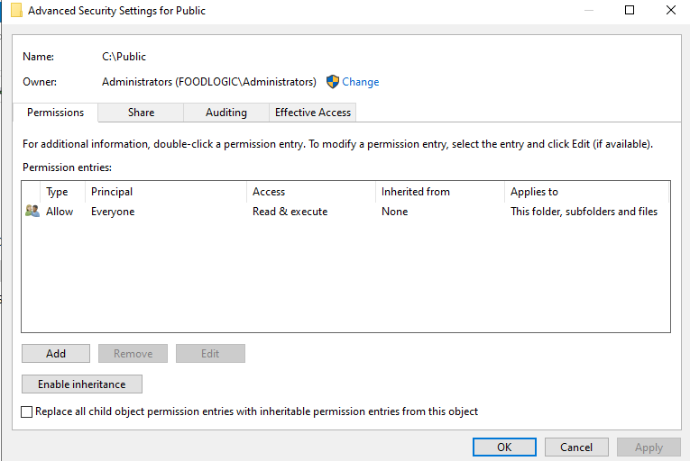

Permisos SMB de "Lectura"

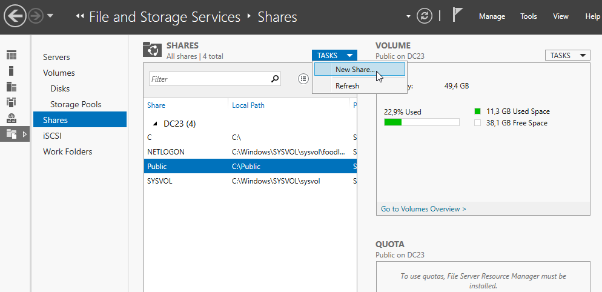

Vamos a **new share** para compartir la carpeta que hemos creado

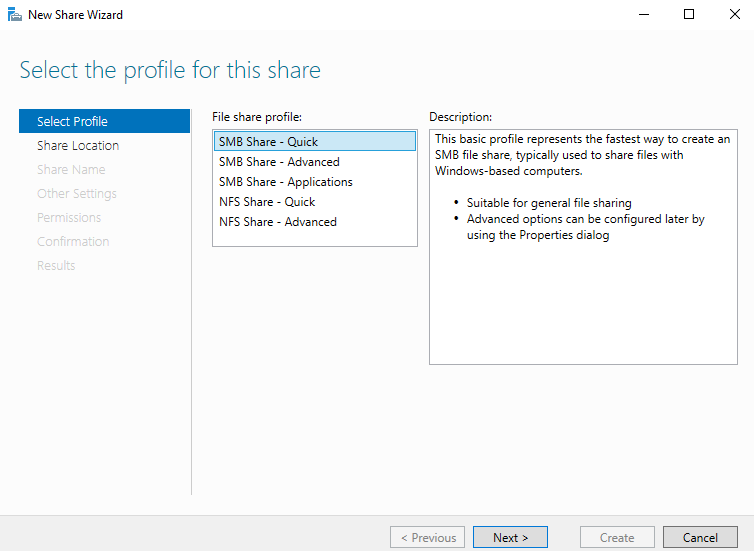

Seleccionamos la opción **SMB Share - Quick**

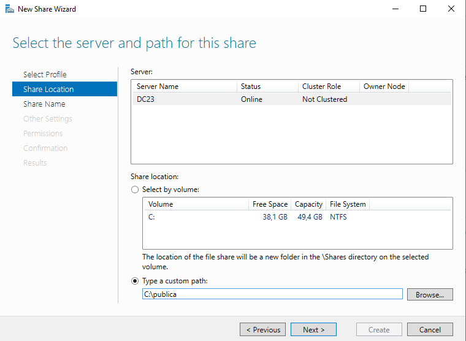

Seleccionamos la **ruta**

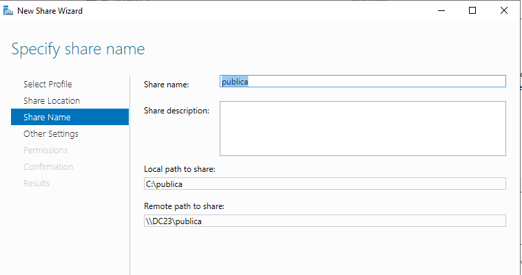
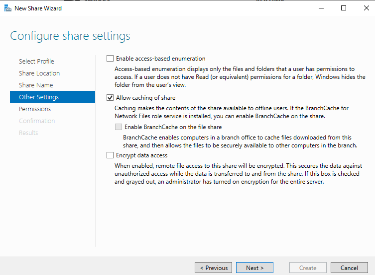

Dejamos seleccionada la opción que viene por **defecto**

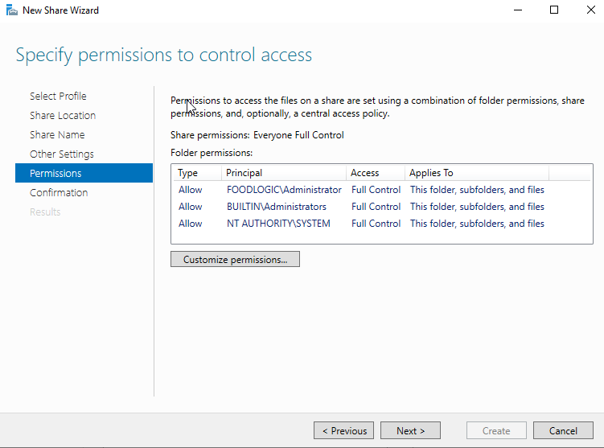

Nos aparece los **permisos** que están asignados a esa carpeta

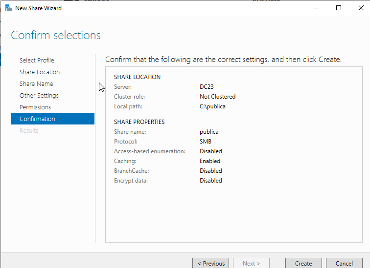

Aquí nos aparecerá el **resumen** de lo que hemos hecho


## B. Carpeta Operaciones (Metodo: Server Manager - FSSM):

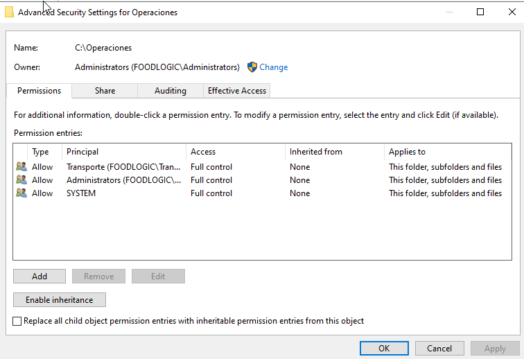

Creamos la carpeta **operaciones**

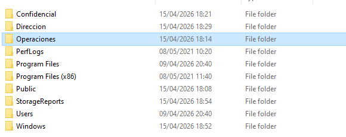

Asignamos los siguientes permisos el cual solo **Transporte** pueda acceder


Vamos a **new share** para compartir la carpeta que hemos creado

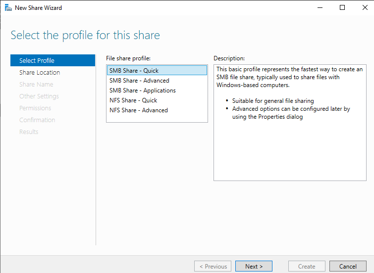

Seleccionamos la opción **SMB Share - Quick**

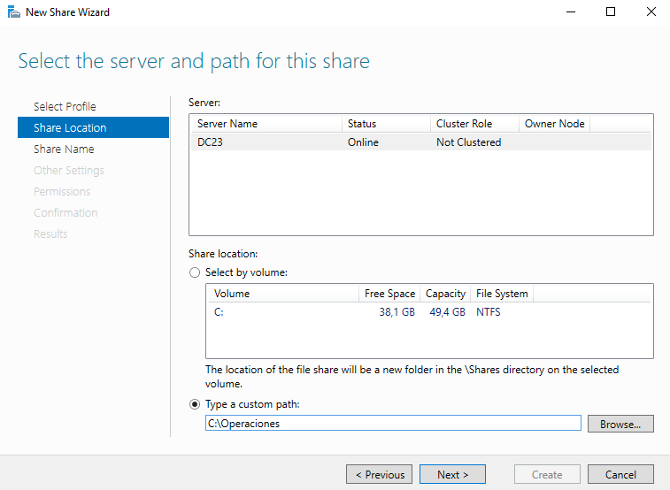

Seleccionamos la **ruta**

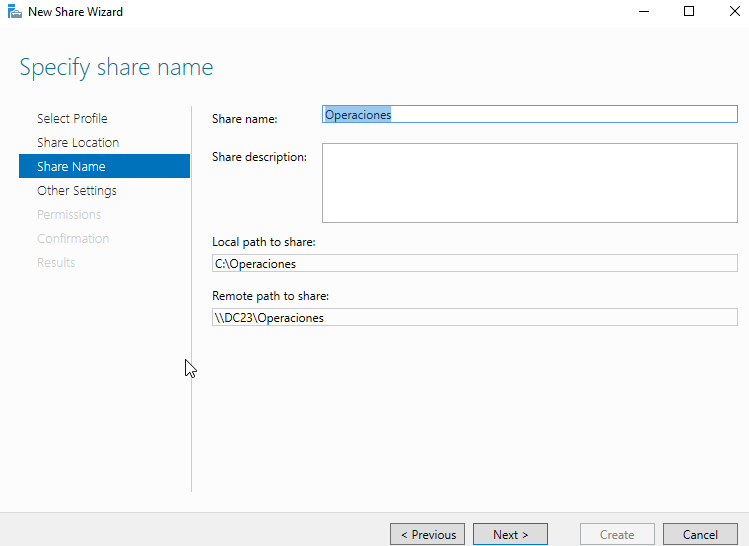
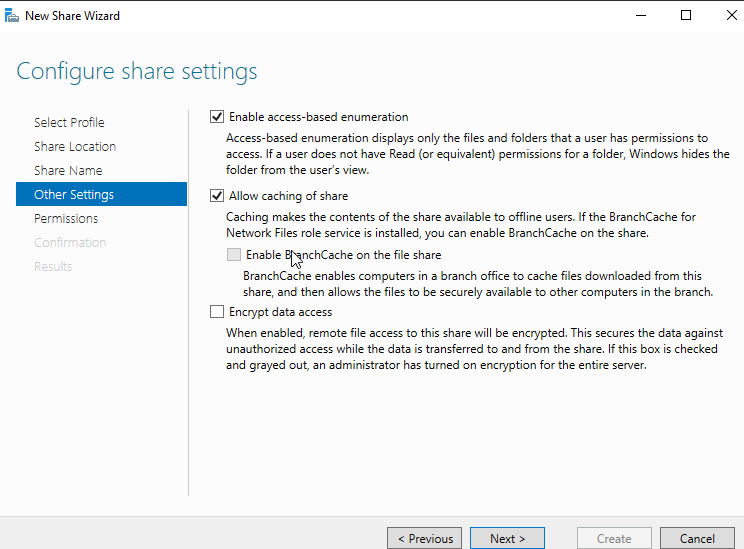

Dejamos seleccionada la opción por **defecto** y además seleccionamos la primera que activa el "**Acces-Based Enumeration**

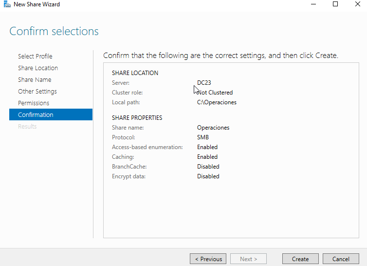

Aquí nos aparecerá el **resumen** de lo que hemos hecho

### - Crear el recurso compartido.
### - Hacer que solo se muestre para los usuarios con acceso (Acces-Based Enumeration)
### - Restricción: NSolo el grupo de **Transporte**  puede acceder.

## C. Carpeta Confidencial (Metodo: PowerShell básico):

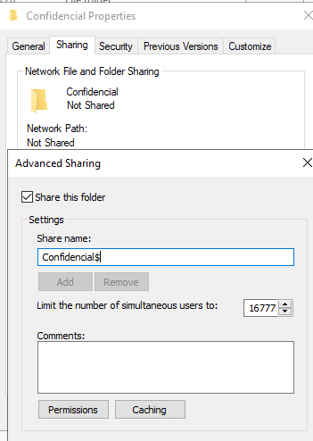

Añadimos el signdo de **$** para que sea invisible

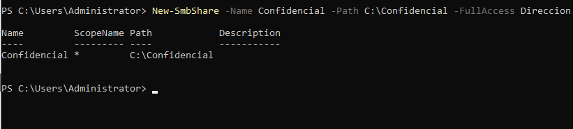

```bash
New-SmbShare -Name Confidencial -Path C:\Confidencial -FullACcess Direccion
```

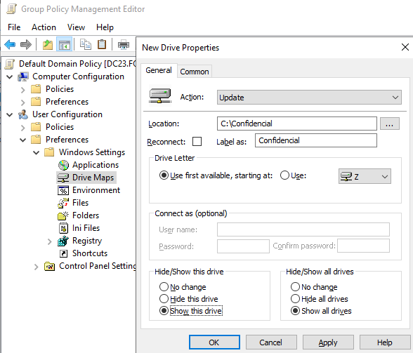

Aquí estamos haciendo el **mapeo de la carpeta** y seleccionamos la opción de **Show this drive**

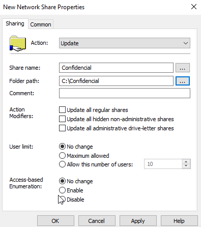
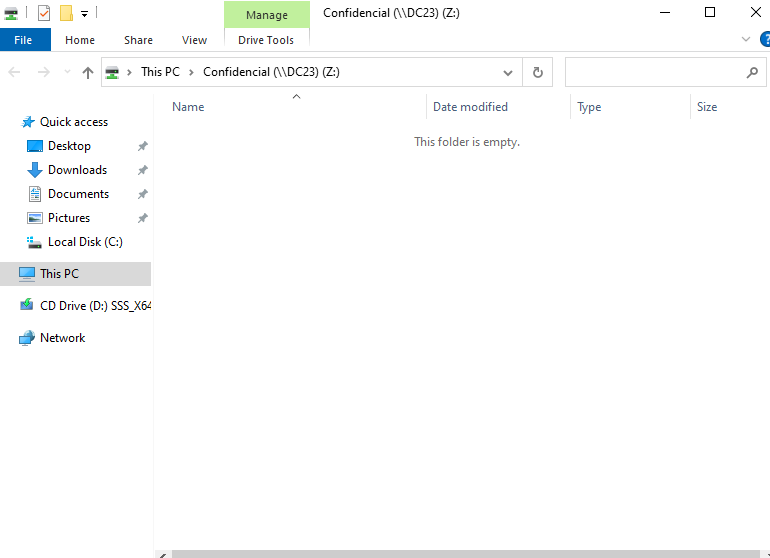
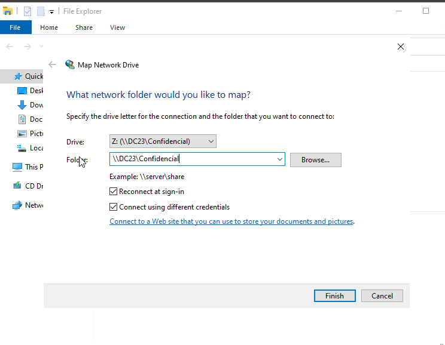

### - Crear la carpeta Direccion$ (recurso ocult).
### - Restricción: solo puede acceder el grupo de Dirección
### - Utilizad el cmdlet New-SmbShare para compartirla.
### - Configurar una GPO para que esta carpeta aparezca automáticamente como unidad Z: solo los usuarios de Dirección.

## D. Carpeta Confidencial (Metodo: PowerShell avanzaso):

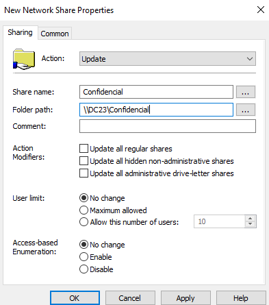
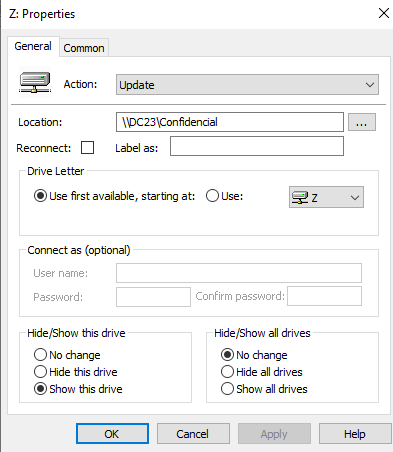
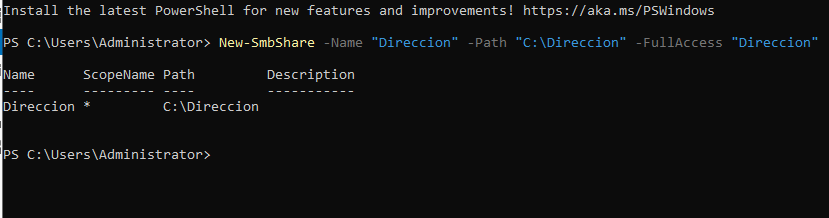

```bash
New-SmbShare -Name Direccion -Path C:\Confidencial -FullACcess Direccion
```

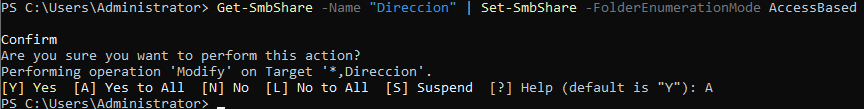

```bash
Get-SmbSHare -Name "Direccion" | Set-SmbShare -FolderEnumerationMode AccessBased
```

### Crear la carpeta Dirección.
### Restricción: solo puede acceder el grupo de Dirección.
### Utilizad el cmdlet New-SmbShare para compartirla y habilitad por PowerShell el Access-Based Enumeration.
### Configurad una GPO para que esta carpeta aparezca automáticamente como la unidad Z: solo los usuarios de Dirección.

## 3. Control de Almacenaje (FSRM y Cuotas NTFS)

### El cliente se queja de que los usuarios guardan fotos personales y llenan el disco.

### Cuotas NTFS (Control por Volumen):
### A la unidad de datos, activad las cuotas NTFS desde las propiedades del volumen

### Estableced un límite de 500 MB por defecto para cualquier usuario nuevo.

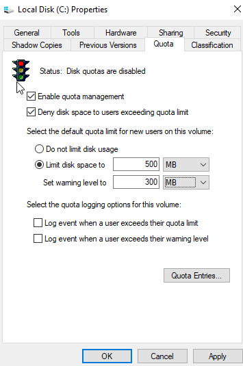

### FSRM (Control por Carpeta):

### Instalad el rol File Server Resource Manager.


### Cuota de Carpeta: A la carpeta Public, aplicad una cuota de 200 MB (Hard Cuota). Configurad un aviso al 90% que envie un mensaje personalizado: "Compte! FoodLogístic t'informa que estàs a punt d'esgotar l'espai compartit."

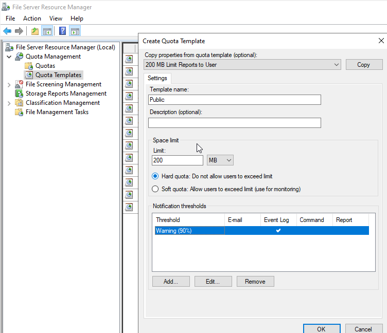

Establecemos el límite de **200 MB por usuario**

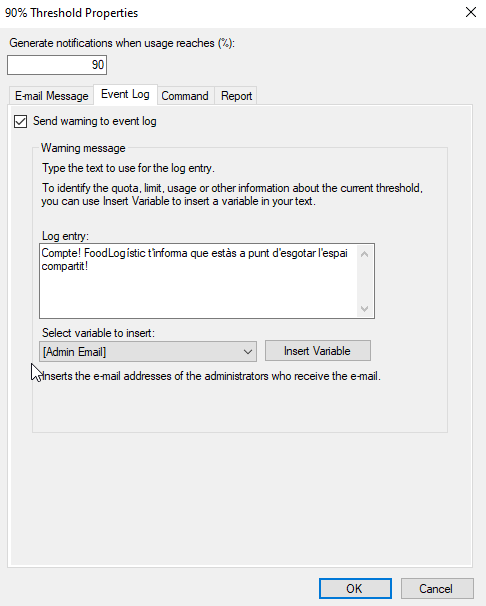

Personalizamos el mensaje personalizado que le aparecerá al **usuario** cuando haya utilizado el 90% de espacio del disco

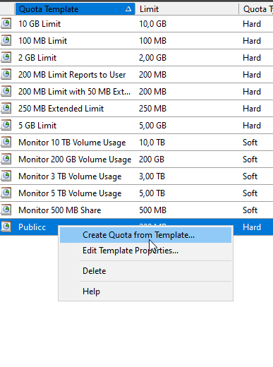

Le damos a la opción de **Create Quota from Template**, lo cual hará que utilizemos la plantilla que hemos creado anteriormente para asignarlo a la carpeta que queramos, en nuestro caso la carpeta **Public**

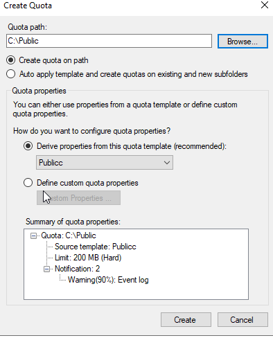

Le asignamos la **ruta** de la carpeta que queremos asignar los límites establecidos anteriormente

### Filtrado por Ficheros: A la carpeta Operaciones, cread un filtro que impida guardar archivos ejecutables (.exe, .msi) y ficheros de audio y video.

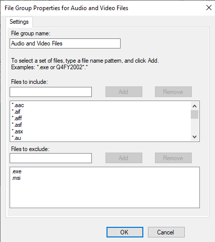

Como podemos ver el el apartado de **Files to exclude** hemos añadido los siguientes:

- .msi
- .exe

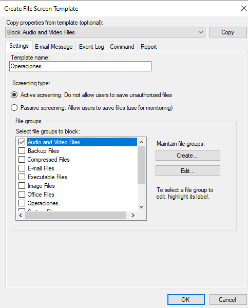

Tambíen exluimos que pueda poner:

- Audio and Video Files

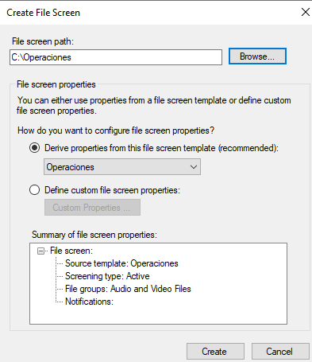

Hacemos lo mismo que anteriormente, de utilizar la plantilla con las configuraciones que hemos puesto
