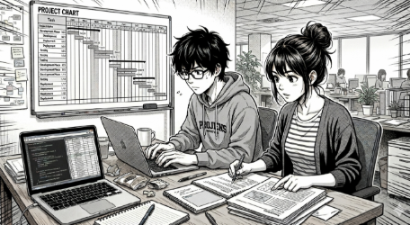

# T09: Estimació temporal de projecte (Diagrama de Gantt professional)

Un dels errors més habituals en equips tècnics novells és confondre “fer feina” amb “gestionar un projecte”. 

Començar a configurar servidors, desenvolupar una web o desplegar serveis sense una planificació rigorosa acostuma a provocar retards, colls d’ampolla i solucions improvisades.

En aquest punt del projecte, la direcció de FoodLogístics S.A. no vol només una proposta tècnica: vol garanties.

**Vol saber:**

- Quan estaran les solucions operatives
- Quin ordre seguireu
- Què passarà si alguna tasca es retarda
- Si sou capaços de treballar com un equip professional

Per tant, el vostre objectiu no és “fer un Gantt”, sinó demostrar que sabeu planificar un projecte real amb criteri tècnic i organitzatiu.

## Solució

A l'arxiu [solució.md](solució.md)  hi ha la solució del producte

[Torna a la pàgina del projecte](../README.md)

