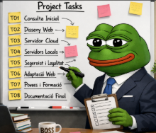
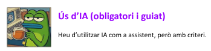
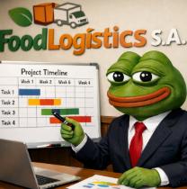
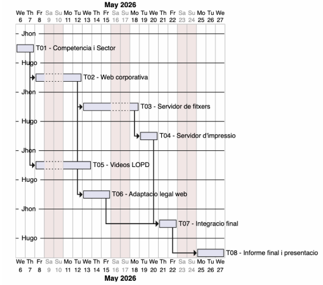
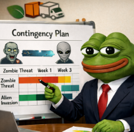

# Solució: T09: Estimació temporal de projecte (Diagrama de Gantt professional)

[T09: Estimació temporal de projecte (Diagrama de Gantt professional): Jhon Justiniano - Hugo Muiños](https://docs.google.com/document/d/1pZphKirJVPus_xB01U1MHfM0NkzX69zClb8NEfKFBsQ/edit?usp=sharing)

# Fase 1: Anàlisi real del projecte (pensament estructural)

## 1.1 Identificació de tasques i dependències



**A partir de les tasques reals del projecte (T01–T08):**

**Identifiqueu:**

- **Ordre lògic d’execució**
  - 1.-T05: Vídeo formatiu LOPD empleats.
  - 2.- T01: Coneixent la competència i el sector
  - 3.-T02: Creant la proposta de pàgina corporativa
  - 4.- T06: Operació Escut Digital: Fent 100% legal la web de FoodLogístic S.A.
  - 5.-T08:  Tria de la web definitiva.
  - 6.-T03: Servidor de fitxers
  - 7.- T07:  Migrant al cloud.
  - 8.-T04: Servidor d’impressió

- **Tasques que poden anar en paral·lel**
  - T07:  Migrant al cloud. **en paralleo con** T01: Coneixent la competència i el sector
  - T02: Creant la proposta de pàgina corporativa **en paralleo con** T06: Operació Escut Digital: Fent 100% legal la web de FoodLogístic S.A.
  - Las demás tascas tienen que ir solas ya que se han de hacer si o si en parejas.

- **Tasques bloquejants**
  - La T02: Creant la proposta de pàgina corporativa no se puede hacer hacer sin la T01: Coneixent la competència i el sector.
  - La T04: Servidor d’impressió no se puede hacer sin la T03: Servidor de fitxers
  - La T08:  Tria de la web definitiva no se puede hacer sin la T02: Creant la proposta de pàgina corporativa

**Heu de respondre preguntes com:**

- **Quines tasques no poden començar sense haver-ne acabat una altra?**
  - La T02: Creant la proposta de pàgina corporativa no se puede hacer hacer sin la T01: Coneixent la competència i el sector.
  - La T04: Servidor d’impressió no se puede hacer sin la T03: Servidor de fitxers
  - La T08:  Tria de la web definitiva no se puede hacer sin la T02: Creant la proposta de pàgina corporativa

- **On poden aparèixer colls d’ampolla?**
  - T03: Servidor de fitxers
  - T04: Servidor d’impressió
  - T07:  Migrant al cloud. **en paralleo con** T01: Coneixent la competència i el sector
  - T02: Creant la proposta de pàgina corporativa **en paralleo con** T06: Operació Escut Digital: Fent 100% legal la web de FoodLogístic S.A.

- **Quines tasques són més crítiques per al projecte?**
  - T05: Vídeo formatiu LOPD empleats.
  - T01: Coneixent la competència i el sector
  - T06: Operació Escut Digital: Fent 100% legal la web de FoodLogístic S.A.
  - T02: Creant la proposta de pàgina corporativa

## 1.2 Identificació del camí crític

**Determineu:**

- **Quines tasques, si es retarden, afecten tot el projecte**
  - T05: Vídeo formatiu LOPD empleats.
  - T01: Coneixent la competència i el sector
  - T06: Operació Escut Digital: Fent 100% legal la web de FoodLogístic S.A.
  - T02: Creant la proposta de pàgina corporativa
  - T03: Servidor de fitxers
  - T04: Servidor d’impressió

- **Quines tenen marge (slack)**
  - T05: Vídeo formatiu LOPD empleats.
  - T01: Coneixent la competència i el sector
  - T02: Creant la proposta de pàgina corporativa
  - T07:  Migrant al cloud.
  - T08:  Tria de la web definitiva.

  ---

# Fase 2: Estimació d’esforç amb criteri (ús d’IA guiat)

**Heu d’estimar la durada de cada tasca en hores, però no de forma arbitrària.**



Lo que se muestra a continuación es la estimación detallada de esfuerzo para las tareas **T01–T08** del proyecto FoodLogístic S.A., siguiendo los criterios obligatorios:
- Tiempo de comprensión 
- Tiempo de investigación 
- Tiempo de implementación técnica 
- Tiempo de pruebas y errores 
- Tiempo de documentación 
- Coordinación con el equipo 
- Interrupciones 
- Margen por imprevistos 

### 📘 Tabla Resumen General

| Tarea | Descripción | Horas Totales |
|-------|-------------|---------------|
| **T01** | Conociendo la competencia y el sector | **4 h** |
| **T02** | Página corporativa (GitHub Pages) | **3 h** |
| **T03** | Servidor de archivos (AD, SMB, FSRM) | **9 h** |
| **T04** | Servidor de impresión (Pooling + GPO) | **5 h** |
| **T05** | Vídeos formativos LOPD | **4 h** |
| **T06** | Adaptación legal de la web | **4 h** |
| **T07** | Migración al cloud (correo corporativo) | **5 h** |
| **T08** | Elección de la web definitiva | **4 h** |

### 🟦 T01 – Conociendo la competencia y el sector 
**Duración total estimada: 4 horas**
- Comprensión: **15 minutos** 
- Investigación: **1 hora** 
- Implementación técnica: **30 minutos** 
- Pruebas y correcciones: **15 minutos** 
- Documentación: **1 hora** 
- Coordinación: **15 minutos** 
- Interrupciones: **15 minutos** 
- Margen: **30 minutos**

### 🟧 T02 – Creación de la página corporativa (GitHub Pages) 
**Duración total estimada: 3 horas**
- Comprensión: **10 minutos** 
- Investigación: **15 minutos** 
- Implementación técnica: **1 hora** 
- Pruebas: **40 minutos** 
- Documentación: **30 minutos h**  
- Interrupciones: **10 minutos** 
- Margen: ** 15 minutos **

### 🟩 T03 – Servidor de archivos (AD, SMB, FSRM, GPO) 
**Duración total estimada: 9 horas**
- Comprensión: **1 h** 
- Investigación: **20 minutos** 
- Implementación técnica: **5 horas** 
- Pruebas: **30 minutos** 
- Documentación: **1 hora** 
- Coordinación: **20 minutos** 
- Interrupciones: **40 minutos h** 
- Margen: **10 minutos**

### 🟥 T04 – Servidor de impresión (Printer Pooling + GPO) 
**Duración total estimada: 5 horas**
- Comprensión: **20** 
- Investigación: **5 minutos** 
- Implementación técnica: **3 horas** 
- Pruebas: **30 minutos** 
- Documentación: **45 minutos** 
- Coordinación: **5 minutos** 
- Interrupciones: **15 minutos** 
- Margen: **0 minutos**

### 🟪 T05 – Vídeos formativos LOPD 
**Duración total estimada: 4 horas**
- Comprensión: **20 minutos** 
- Investigación: **30 minutos** 
- Implementación técnica (guiones + grabación + edición): **2 h** 
- Pruebas: **5 minutos** 
- Documentación: **20 minutos** 
- Coordinación: **5 minutos** 
- Interrupciones: **20 minutos** 
- Margen: **20 minutos **

### 🟫 T06 – Adaptación legal de la web (LOPDGDD + LSSI) 
**Duración total estimada: 4 horas**
- Comprensión: **20 minutos ** 
- Investigación: **30 minutos** 
- Implementación técnica: **2 h** 
- Pruebas: **5 minutos** 
- Documentación: **20 minutos** 
- Coordinación: **10 minutos** 
- Interrupciones: **20 minutos** 
- Margen: **15 minutos**

### 🟦 T07 – Migrando al cloud (correo corporativo y colaboración) 
**Duración total estimada: 5 horas**
- Comprensión: **20 minutos** 
- Investigación (proveedores y planes): **30 minutos** 
- Implementación técnica / análisis comparativo: **2 h** 
- Pruebas y revisión de cálculos: **10 minutos**
- Documentación (propuesta comercial y técnica): **1,30 h** 
- Coordinación: **5 minutos** 
- Interrupciones: **20 minutos** 
- Margen: **5 minutos**

### 🟧 T08 – Elección de la web definitiva 
**Duración total estimada: 4 horas**
- Comprensión: **30 minutos**
- Investigación (criterios y comunicación asertiva): **20 minutos** 
- Implementación (reflexiones + informe de consenso): **1 h** 
- Pruebas y revisión: **20 minuto** 
- Documentación/pulido: **40 minutos** 
- Coordinación (reunión, debate, consenso): **40 minutos** 
- Interrupciones: **20 minutos h** 
- Margen: **10 minutos**

### 📌 Notas finales
- Las horas están calculadas según la complejidad real de cada tarea. 
- La estimación incluye margen para imprevistos y carga académica. 

---

# Fase 3: Assignació de recursos (treball en equip real)

**Distribuir les tasques entre els membres de l’equip:**

- **Qui fa què**

Hugo: 
- T01: Fase 1: Coneixent el terreny i la competència
- T02: Creant la proposta de pàgina corporativa
- T06: Operació Escut Digital: Fent 100% legal la web de FoodLogístic S.A.

Jhon:
- T01: Fase 2: Estratègia
- T02: Creant la proposta de pàgina corporativa
- T06: Operació Escut Digital: Fent 100% legal la web de FoodLogístic S.A.

- **Tasques compartides entre Jhon y Hugo**
  - T03: Servidor de fitxersT05: Vídeo formatiu LOPD empleats.
  - T04: Servidor d’impressió
  - T05: Vídeo formatiu LOPD empleats.
  - T07:  Migrant al cloud.
  - T08:  Tria de la web definitiva.

- **Si hi ha dependència entre membres**
  - T03: Servidor de fitxers: Si Hugo que es especialista en server no ha acabado y está con la parte de server, Jhon no puede hacer las comprobaciones del cliente.
  - T04: Servidor d’impressió: Si hugo no ha acabado la parte de configuraciones aún no se puede hacer las comprobaciones.
  - T05: Vídeo formatiu LOPD empleats: Si Jhon está haciendo la parte de los guiones no se puede grabar los vídeos.
  - T07:  Migrant al cloud.: Si uno de los dos miembros del grupo está con la parte de comparativas y de cálculos de los costos, el otro miembro aún no puede hacer la parte de la redacción de la propuesta.

---

# Fase 4: Construcció del diagrama de Gantt (UMLTree)



### Codi:

```js
@startgantt
Project starts the 2026-05-06
saturday are closed
sunday are closed


-- Jhon --
[T01 - Competencia i Sector] lasts 2 days


-- Hugo --
[T02 - Web corporativa] lasts 3 days
[T02 - Web corporativa] starts at [T01 - Competencia i Sector]'s end


-- Jhon --
[T03 - Servidor de fitxers] lasts 4 days
[T03 - Servidor de fitxers] starts at [T02 - Web corporativa]'s end


-- Hugo --
[T04 - Servidor d'impressio] lasts 2 days
[T04 - Servidor d'impressio] starts at [T03 - Servidor de fitxers]'s end


-- Jhon --
[T05 - Videos LOPD] lasts 4 days
[T05 - Videos LOPD] starts at [T01 - Competencia i Sector]'s end


-- Hugo --
[T06 - Adaptacio legal web] lasts 3 days
[T06 - Adaptacio legal web] starts at [T02 - Web corporativa]'s end


-- Jhon --
[T07 - Integracio final] lasts 2 days
[T07 - Integracio final] starts at [T04 - Servidor d'impressio]'s end
[T07 - Integracio final] starts at [T06 - Adaptacio legal web]'s end


-- Hugo --
[T08 - Informe final i presentacio] lasts 3 days
[T08 - Informe final i presentacio] starts at [T07 - Integracio final]'s end


@endgantt


```

### diagrama de Gantt:



---

# Fase 5: Pla de contingència (pensament professional)



| Riscos crítics                                                                 | Impacte en el projecte                                                                 | Estratègia de mitigació                                                                 |
|-------------------------------------------------------------------------------|----------------------------------------------------------------------------------------|------------------------------------------------------------------------------------------|
| Mala configuración del servidor (T03: Servidor de fitxers, T04: Impressió)    | Retraso del proyecto o necesidad de configurar el servidor desde cero                 | Hacer snapshots de la máquina, usar checklist y documentar el proceso                   |
| Incumplimiento de requisitos legales en la web (T06: Operació Escut Digital)  | Retraso del proyecto por tener que adaptar nuevamente la web                          | Crear una plantilla previa antes de desarrollar la versión definitiva                   |
| Fallos eléctricos o falta de conectividad en el colegio                       | Imposibilidad de avanzar en el proyecto                                                | Sincronizar en la nube (GitHub) y hacer commits frecuentes en local                     |
| Problemas al crear máquinas virtuales (errores o falta de espacio)            | Fallos al abrir o ejecutar máquinas virtuales                                          | Limpiar el equipo regularmente y usar discos externos                                   |
| Apagón inesperado                                                             | Retraso en el proyecto                                                                 | Guardar constantemente el progreso para evitar pérdidas de información                  |

---

[T09: Estimació temporal de projecte (Diagrama de Gantt professional): Jhon Justiniano - Hugo Muiños](https://docs.google.com/document/d/1pZphKirJVPus_xB01U1MHfM0NkzX69zClb8NEfKFBsQ/edit?usp=sharing)


---

[Torna a l'enunciat](README.md)


