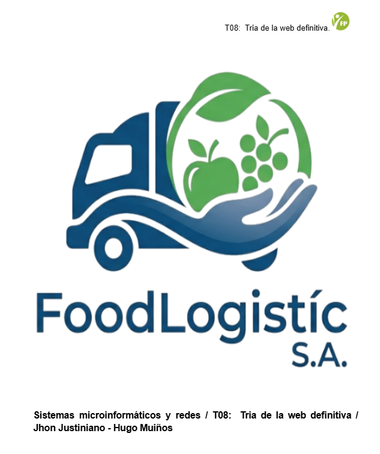
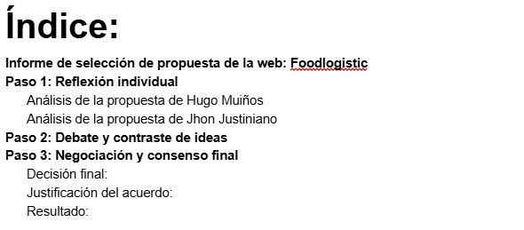
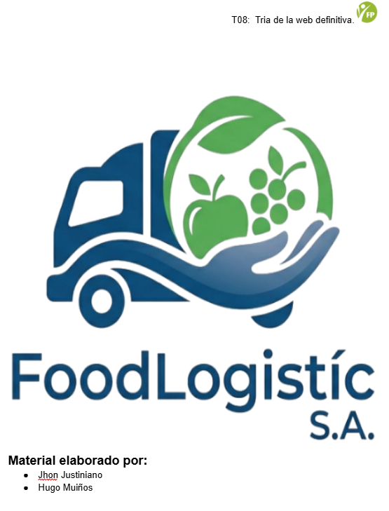

# Solució: T08:  Tria de la web definitiva.

Tienen la solución de la actividad en documento por si se les hes más fácil: [T08:  Tria de la web definitiva: Jhon Justiniano-Hugo Muiños](https://docs.google.com/document/d/1m9U54BNHIF-9KtYRqxSak9OOGyMDhl6WDIO8BYz_XkQ/edit?usp=sharing)

# Informe de selección de propuesta de la web: Foodlogistic

Este documento detalla no solo todo el proceso del análisis, si no también el debate y la toma de decisión del equipo para así realizar una entrega de la página web corporativa del cliente Foodlogistic.

# Paso 1: Reflexión individual

En esta fase, cada miembro tanto Jhon Justiniano como Hugo Muiños hemos analizado nuestro propio trabajo con autocrítica para identificar qué aporta al cliente.

## Análisis de la propuesta de Hugo Muiños

**URL:** [web de Hugo Muiños](https://pupilsito.github.io/web-corporativa/)

**Puntos fuertes:**

- La web de Hugo Muiños presenta un diseño extremadamente limpio y minimalista. También tiene una estructura del código la cuál es ligera, lo que nos garantiza una velocidad de carga rápida. Es una web funcional que va directo al grano, ideal para usuarios que buscan información de contacto inmediata.

**Puntos débiles:**

- Es un poco baja para una empresa que busca destacar en un mercado competitivo, la falta de elementos visuales dinámicos o una jerarquía visual más marcada hace que la empresa no termine de ver su potencia logística.

## Análisis de la propuesta de Jhon Justiniano

**URL:** [web de Jhon Justiniano](https://jhonjustinianogit.github.io/web-corporativa-foodlogistic/)

**Puntos fuertes:**

- La web de Jhon Justiniano tiene un buen aspecto visual, ya que el uso de imágenes de alta resolución sobre el transporte y el almacenamiento pone al usuario de una manera rápida  en el contexto del negocio de la empresa Foodlogitic, además la navegación está muy bien estructurada con buenas secciones diferentes lo que transmite fortaleza, confianza y también  modernidad.

**Puntos débiles:**

- La web al tener un poco más de contenido gráfico, el cuál requiere una optimización de imágenes.

---

# Paso 2: Debate y contraste de ideas

Durante esta fase, nosotros como equipo nos hemos reunido para poner en común las dos propuestas, tanto la de Hugo Muiños como la de Jhon Justiniano dando como resultado lo siguiente:

- **Exposición de Hugo:** Hugo Muiños defendió su enfoque centrado en la experiencia de usuario y el diseño visual. Sin embargo, reconoció que él buscaba la máxima eficiencia técnica al centrarse en la parte estética y se dió cuenta de que a su diseño le faltaba un poco más de personalidad que se incorpore con una web corporativa que es la de FoodLogistic y necesitaba transmitir un poco más de seguridad a sus respectivos proveedores. Pero también aceptó que las páginas de avisos legales entre otras cosas están en la barra de cookies dado que lo correcto sería al final de la página principal.

- **Exposición de Jhon:** Jhon Justiniano argumentó que una web corporativa debe tener un enfoque rápido pero defendió que su prioridad de él fue construir una buena base, la cuál proteja tanto a la empresa como a los usuarios que dejan sus datos, además que se enfocó en que el cliente sintiera lo que es estar en una web de empresa creyendo que el impacto y la navegación es muy importante para causar buenas impresiones al cliente.

- **Intercambio de impresiones y conclusión del debate:** El equipo valoró que el diseño de Hugo Muiños es muy atractivo, pero se llegó a la conclusión unánime de que al lanzar una web sin una buena estructura es un error que ahora mismo no pueden permitirse. Llegando así al acuerdo de que una buena estética es lo que enriquece al cliente y es lo que mejor les funciona ahora mismo.

---

# Paso 3: Negociación y consenso final

Después del proceso de negociación que ha sido basado en criterios técnicos y profesionales, el equipo ha tomado la siguiente decisión definitiva:

## Decisión final: 

Se eligió la propuesta desarrollada por [Jhon Justiniano](https://jhonjustinianogit.github.io/web-corporativa-foodlogistic/) como la web oficial para el cliente FoodLogistic.

## Justificación del acuerdo:

La decisión ha sido basada en lo siguiente:

- **Impacto visual y branding:** La web de Jhon Justiniano utiliza una buena línea estética que transmite profesionalidad, ya que en el sector de la logística las imágenes, la tecnología y la web moderna es muy importante. Además su diseño logra transmitir lo que es FoodLogistic, una empresa líder e importante en el sector  y no como un pequeño negocio local.

- **Estructura de servicios:** Jhon Justiniano ha sabido desglosar las capacidades de la empresa que son el transporte, el almacenaje y la gestión y esto es fundamental para que los clientes potenciales entiendan rápidamente el alcance de Foodlogistic.

- **Experiencia de usuario:** Mientras que la web de Hugo Muiños cumple la experiencia, la web de Jhon Justiniano guía al usuario a través de una narrativa visual, ya que el uso de los banners, las tipografías corporativas y una buena disposición de bloques lo cuál esto equilibra y facilita la lectura y el contacto.

- **Escalabilidad:** El diseño de Jhon Justiniano permite añadir nuevas secciones si fuera necesario más adelante como por ejemplo un blog de noticias logísticas o un área de clientes de una forma mucho más orgánica que el diseño minimalista de Hugo Muiños.

## Resultado: 

Nosotros como equipo presentaremos la [web de Jhon Justiniano](https://jhonjustinianogit.github.io/web-corporativa-foodlogistic/) como la solución definitiva, así de esta forma garantizar la profesionalidad y cumpliendo la normativa y una buena estructura de servicios.

---

Tienen la solución de la actividad en documento por si se les hes más fácil: [T08:  Tria de la web definitiva: Jhon Justiniano-Hugo Muiños](https://docs.google.com/document/d/1m9U54BNHIF-9KtYRqxSak9OOGyMDhl6WDIO8BYz_XkQ/edit?usp=sharing)

---

[Torna a l'enunciat](README.md)

