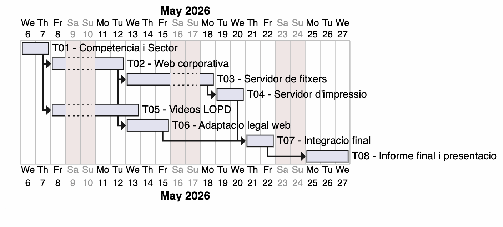

# 2. Codigo PlantUML y imagen del diagrama de Gantt

## Fase 2 — Estimación de Esfuerzo con Criterio

Este documento recoge la estimación detallada de esfuerzo para las tareas **T01–T08** del proyecto FoodLogístic S.A., siguiendo los criterios obligatorios:

- Tiempo de comprensión  
- Tiempo de investigación  
- Tiempo de implementación técnica  
- Tiempo de pruebas y errores  
- Tiempo de documentación  
- Coordinación con el equipo  
- Interrupciones  
- Margen por imprevistos  

---

## 📘 Tabla Resumen General

| Tarea | Descripción | Horas Totales |
|-------|-------------|---------------|
| **T01** | Conociendo la competencia y el sector | **10 h** |
| **T02** | Página corporativa (GitHub Pages) | **12 h** |
| **T03** | Servidor de archivos (AD, SMB, FSRM) | **14 h** |
| **T04** | Servidor de impresión (Pooling + GPO) | **8 h** |
| **T05** | Vídeos formativos LOPD | **16 h** |
| **T06** | Adaptación legal de la web | **10 h** |
| **T07** | Migración al cloud (correo corporativo) | **12 h** |
| **T08** | Elección de la web definitiva | **8 h** |

---

## 🟦 T01 – Conociendo la competencia y el sector  
**Duración total estimada: 10 horas**

- Comprensión: **1 h**  
- Investigación: **2 h**  
- Implementación técnica: **3 h**  
- Pruebas y correcciones: **1 h**  
- Documentación: **2 h**  
- Coordinación: **0,5 h**  
- Interrupciones: **0,25 h**  
- Margen: **0,25 h**

---

## 🟧 T02 – Creación de la página corporativa (GitHub Pages)  
**Duración total estimada: 12 horas**

- Comprensión: **1 h**  
- Investigación: **1,5 h**  
- Implementación técnica: **6 h**  
- Pruebas: **1,5 h**  
- Documentación: **1,5 h**  
- Coordinación: **0,5 h**  
- Interrupciones: **0,25 h**  
- Margen: **0,25 h**

---

## 🟩 T03 – Servidor de archivos (AD, SMB, FSRM, GPO)  
**Duración total estimada: 14 horas**

- Comprensión: **1 h**  
- Investigación: **2 h**  
- Implementación técnica: **7 h**  
- Pruebas: **2 h**  
- Documentación: **1,5 h**  
- Coordinación: **0,5 h**  
- Interrupciones: **0,25 h**  
- Margen: **0,25 h**

---

## 🟥 T04 – Servidor de impresión (Printer Pooling + GPO)  
**Duración total estimada: 8 horas**

- Comprensión: **0,75 h**  
- Investigación: **1 h**  
- Implementación técnica: **4 h**  
- Pruebas: **1,5 h**  
- Documentación: **0,75 h**  
- Coordinación: **0,5 h**  
- Interrupciones: **0,25 h**  
- Margen: **0,25 h**

---

## 🟪 T05 – Vídeos formativos LOPD  
**Duración total estimada: 16 horas**

- Comprensión: **1 h**  
- Investigación: **4 h**  
- Implementación técnica (guiones + grabación + edición): **7 h**  
- Pruebas: **1,5 h**  
- Documentación: **1,5 h**  
- Coordinación: **1 h**  
- Interrupciones: **0,5 h**  
- Margen: **0,5 h**

---

## 🟫 T06 – Adaptación legal de la web (LOPDGDD + LSSI)  
**Duración total estimada: 10 horas**

- Comprensión: **1 h**  
- Investigación: **2 h**  
- Implementación técnica: **4 h**  
- Pruebas: **1,5 h**  
- Documentación: **1 h**  
- Coordinación: **0,5 h**  
- Interrupciones: **0,25 h**  
- Margen: **0,25 h**

---

## 🟦 T07 – Migrando al cloud (correo corporativo y colaboración)  
**Duración total estimada: 12 horas**

- Comprensión: **1 h**  
- Investigación (proveedores y planes): **3 h**  
- Implementación técnica / análisis comparativo: **4 h**  
- Pruebas y revisión de cálculos: **0,5 h**  
- Documentación (propuesta comercial y técnica): **2,5 h**  
- Coordinación: **0,5 h**  
- Interrupciones: **0,25 h**  
- Margen: **0,25 h**

---

## 🟧 T08 – Elección de la web definitiva  
**Duración total estimada: 8 horas**

- Comprensión: **0,75 h**  
- Investigación (criterios y comunicación asertiva): **0,5 h**  
- Implementación (reflexiones + informe de consenso): **3 h**  
- Pruebas y revisión: **1 h**  
- Documentación/pulido: **1 h**  
- Coordinación (reunión, debate, consenso): **1 h**  
- Interrupciones: **0,25 h**  
- Margen: **0,5 h**

---

## 📌 Notas finales

- Las horas están calculadas según la complejidad real de cada tarea.  
- La estimación incluye margen para imprevistos y carga académica.  
- Este documento forma parte del entregable oficial del proyecto FoodLogístic S.A.

# 4. Construcción del diagrama de Gantt (UMLTree)

```js
@startgantt
Project starts the 2026-05-06
saturday are closed
sunday are closed

-- Jhon --
[T01 - Competencia i Sector] lasts 2 days

-- Hugo --
[T02 - Web corporativa] lasts 3 days
[T02 - Web corporativa] starts at [T01 - Competencia i Sector]'s end

-- Jhon --
[T03 - Servidor de fitxers] lasts 4 days
[T03 - Servidor de fitxers] starts at [T02 - Web corporativa]'s end

-- Hugo --
[T04 - Servidor d'impressio] lasts 2 days
[T04 - Servidor d'impressio] starts at [T03 - Servidor de fitxers]'s end

-- Jhon --
[T05 - Videos LOPD] lasts 4 days
[T05 - Videos LOPD] starts at [T01 - Competencia i Sector]'s end

-- Hugo --
[T06 - Adaptacio legal web] lasts 3 days
[T06 - Adaptacio legal web] starts at [T02 - Web corporativa]'s end

-- Jhon --
[T07 - Integracio final] lasts 2 days
[T07 - Integracio final] starts at [T04 - Servidor d'impressio]'s end
[T07 - Integracio final] starts at [T06 - Adaptacio legal web]'s end

-- Hugo --
[T08 - Informe final i presentacio] lasts 3 days
[T08 - Informe final i presentacio] starts at [T07 - Integracio final]'s end

@endgantt 
```


