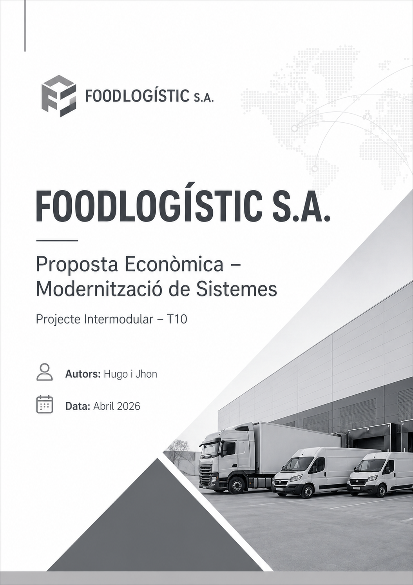

# Solució: T10: Pressupost del projecte.

**T10: Pressupost del projecte / Sistemes microinformàtics i Xarxes / Jhon Justiniano - Hugo Muiños**

# 1. PRESSUPOST D’IMPLANTACIÓ (PAGAMENT ÚNIC)

## 1.1 Maquinari i Programari Inicial

| Element                               | Quantitat | Preu unitari                     | Cost total |
|--------------------------------------|----------|----------------------------------|------------|
| Servidor virtual VPS Pro             | 2        | 35 €/mes (facturació anual)     | 840 €/any  |
| Firewall Cloud + Monitoratge         | 1        | 120 €                           | 120 €      |
| Certificat SSL EV                    | 1        | 90 €                            | 90 €       |
| Llicència Windows Server Datacenter  | 1        | 180 €                           | 180 €      |

**Total Maquinari i Programari: 1.230 €**

## 1.2 Honoraris Professionals

**Preu/hora aplicat: 40 €/h**

| Tasca                                   | Hores | Cost  |
|----------------------------------------|------|-------|
| Configuració servidors d’alta disponibilitat | 12 h | 480 € |
| Migració al núvol                      | 5 h  | 200 € |
| Vídeo formatiu LOPD                    | 5 h  | 200 € |
| Nova landing page                      | 20 h | 800 € |

**Total Honoraris: 1.680 € + IVA**

**Total Honoraris amb IVA: 2.032,8 €**

## 1.3 Resum del Cost d’Implantació

| Conceptes                 | Cost       |
|--------------------------|-----------|
| Maquinari i Programari   | 1.230 €   |
| Honoraris                | 2.032,8 € |
| **TOTAL IMPLANTACIÓ**        | 3.262,8 € |

---

# 2. PRESSUPOST RECURRENT (MENSUAL / ANUAL)

## 2.1 Subscripcions SaaS

**Microsoft 365 Business Standard**
 10,80 €/usuari/mes × 35 usuaris = **378 €/mes + IVA= 457,38 €/mes**

## 2.2 Hosting i Domini

| Servei               | Cost     |
|----------------------|----------|
| Hosting professional | 12 €/mes |
| Domini .com          | 1 €/mes  |
| SSL EV               | 7,5 €/mes |

**Total Hosting + Domini: 20,5 €/mes**

## 2.3 Suport i Manteniment Preventiu

**Inclou:**

- Còpies de seguretat

- Actualitzacions de seguretat

- Resolució d’incidències

- Monitoratge bàsic

**Quota mensual: 120 €**

## 2.4 Resum de Costos Recurrents

| Conceptes             | Cost mensual | Cost anual  |
|-----------------------|-------------|-------------|
| Subscripció SaaS      | 457,38 €    | 5.488,56 €  |
| Hosting + Domini      | 20,5 €      | 246 €       |
| Suport i manteniment  | 120 €       | 1.440 €     |
| **TOTAL RECURRENT**       | **597,88 €**    | **7.174,56 €**  |

---

# 3. JUSTIFICACIÓ DE LA PROPOSTA

## 3.1. Preu/hora

El rang habitual de mercat per a consultoria TIC és 30–50 €/h. Es per això s’ha triat 40 €/h per ajustar-se a un nivell professional i competitiu.

## 3.2. Subscripció SaaS

Microsoft 365 Business Standard ofereix:

- Todo en una sola plataforma (productividad + comunicación)
- Trabajo colaborativo en tiempo real
- Acceso desde cualquier dispositivo
- Correo profesional y calendario empresarial
- Gran capacidad de almacenamiento
- Seguridad integrada
- Escalabilidad y coste controlado
- Automatización y eficiencia

**Es per això que és el model més adequat per a FoodLogístic S.A.**

## 3.3. Hosting

Hosting professional per garantir:
- Alta disponibilitat
- Suport 24/7
- Certificat SSL
- Rendiment estable

## 3.4. Manteniment

La quota cobreix 2–3 h mensuals de treball tècnic i disponibilitat per incidències.

---

# 4. RESUM FINAL AMB IVA

| Tipus de cost              | Import        |
|----------------------------|--------------|
| Cost d’implantació         | 3.262,8 €    |
| Cost recurrent mensual     | 597,88 €     |
| Cost recurrent anual       | 7.174,56 €   |

---

[Torna a l'enunciat](README.md)

